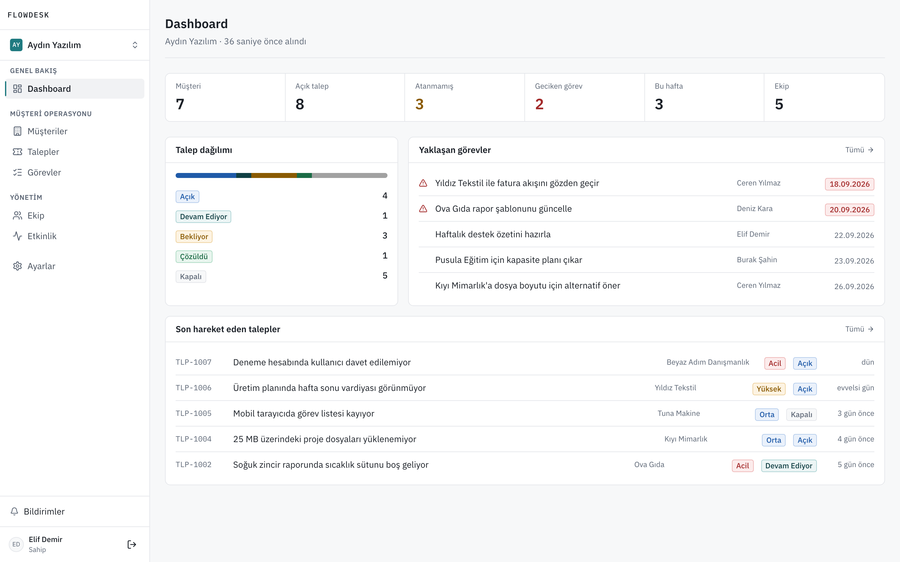
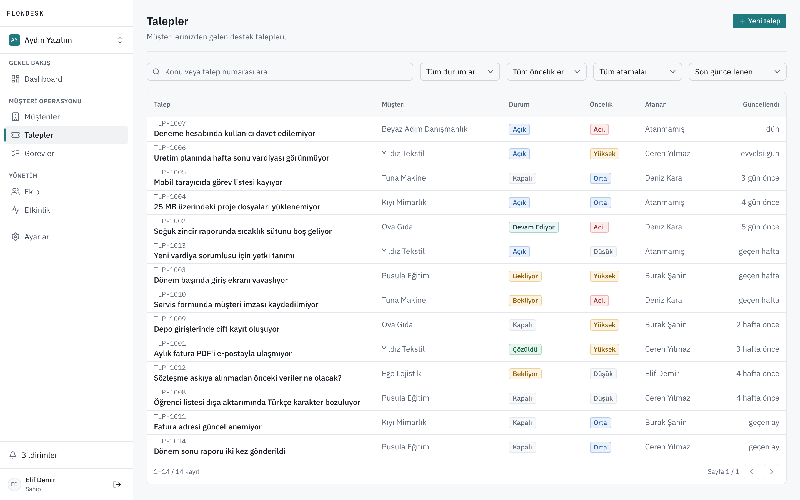
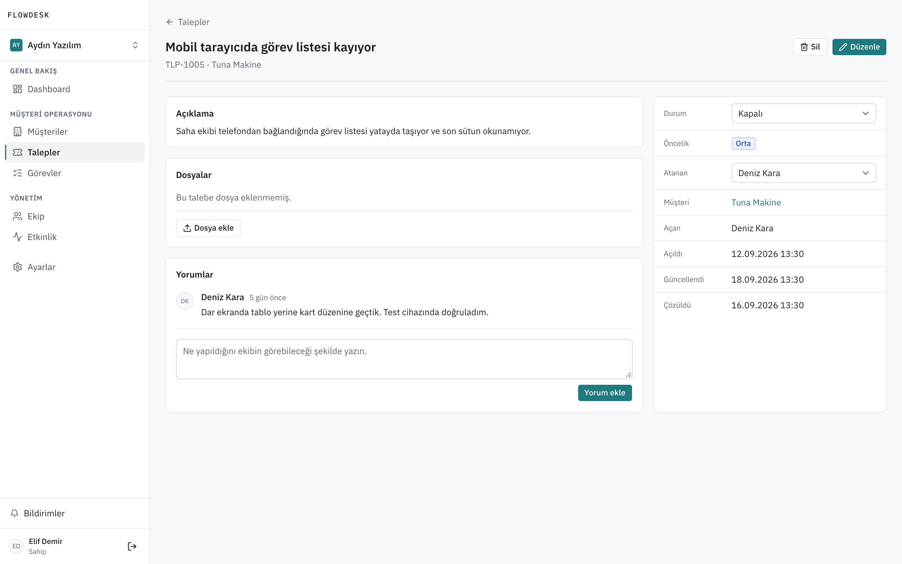
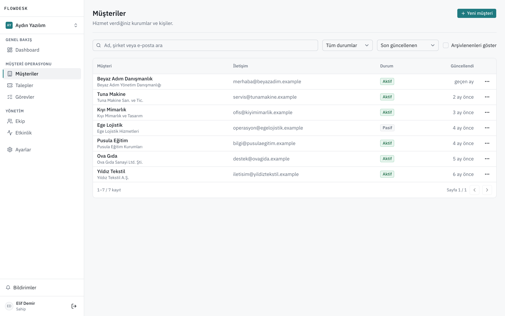
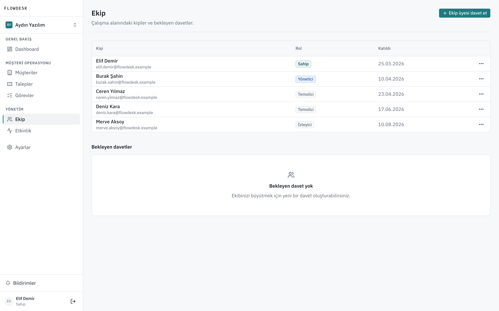
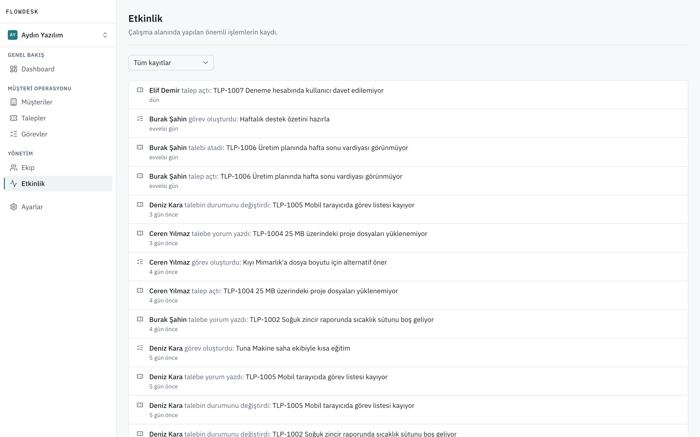
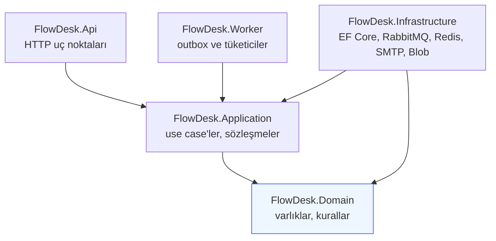

# FlowDesk


Küçük ve orta ölçekli ekipler için çok kiracılı (multi-tenant) B2B müşteri
operasyonları platformu. Organizasyonlar kendi çalışma alanlarında müşterilerini,
destek taleplerini, görevlerini ve ekiplerini yönetir.

Ürün arayüzü ve dokümantasyon Türkçe'dir; kaynak kod tanımlayıcıları
İngilizce'dir.

> **Durum:** Çekirdek kapsam tamamlandı; güncel ilerleme `docs/PROGRESS.md`
> içindedir.

---

## Ekran görüntüleri

Aşağıdakilerin tamamı çalışan uygulamadan, demo verisiyle alınmıştır
(`npm --prefix e2e run screenshots`). Görünen bütün e-posta adresleri
`.example` alan adındadır; RFC 2606 gereği hiçbiri kayıt edilemez.



<table>
  <tr>
    <td width="50%"></td>
    <td width="50%"></td>
  </tr>
  <tr>
    <td>Talep listesi — durum, öncelik ve atanan kişiye göre filtreleme</td>
    <td>Talep detayı — durum geçişi, atama, yorumlar ve dosya ekleri</td>
  </tr>
  <tr>
    <td></td>
    <td></td>
  </tr>
  <tr>
    <td>Müşteriler — Türkçe arama, durum filtresi, arşivleme</td>
    <td>Ekip — rol matrisi ve bekleyen davetler</td>
  </tr>
  <tr>
    <td colspan="2"></td>
  </tr>
  <tr>
    <td colspan="2">Etkinlik — çalışma alanında ne olduğunun, kim yaptığının kaydı</td>
  </tr>
</table>

---

## Teknoloji

**Backend** — .NET 10, ASP.NET Core, Entity Framework Core, PostgreSQL

**Frontend** — Next.js, TypeScript, Tailwind CSS, TanStack Query,
TanStack Table, React Hook Form, Zod

**Altyapı** — Docker Compose, RabbitMQ, Redis, Mailpit, Azurite

**Test** — xUnit, WebApplicationFactory, Testcontainers, Playwright

**Gözlemlenebilirlik** — Serilog, OpenTelemetry, Prometheus, Grafana

Her bileşen somut bir problem çözdüğü için seçilmiştir. Gerekçeler
`docs/DECISIONS.md` içindedir.

---

## Öne çıkan mühendislik kararları

- **Modüler monolit.** Mikroservis değil. Tek ekip, yüksek tutarlılık ihtiyacı
  ve süreç içi çağrılar bu ölçekte doğru tercih. Modül sınırları mimari
  testlerle korunuyor. (ADR-0001)
- **Kiracı izolasyonu bir güvenlik sınırı.** Üyelik doğrulaması, EF Core global
  query filter ve yazma tarafı sahiplik kontrolü olmak üzere üç savunma
  katmanı. Yabancı kaynak için `403` değil `404` dönülüyor, böylece kayıt
  varlığı sızmıyor. (ADR-0002, ADR-0007)
- **Token saklama.** Access token yalnızca tarayıcı belleğinde ve
  `Authorization: Bearer` ile taşınıyor; `localStorage` kullanılmıyor. Refresh
  token `HttpOnly` çerezde, döner, veritabanında hash'li saklanıyor ve replay
  tespit edildiğinde tüm oturum ailesi iptal ediliyor. (ADR-0006)
- **Soyutlama disiplini.** MediatR yok, generic `IRepository<T>` yok, generic
  UnitOfWork yok. `DbContext` zaten Unit of Work; EF Core doğrudan ve bilinçli
  kullanılıyor. (ADR-0004)
- **Outbox Pattern.** Entegrasyon olayları iş verisiyle aynı transaction'da
  kaydediliyor; Worker bunları `FOR UPDATE SKIP LOCKED` ile yayınlıyor.
  Tüketiciler at-least-once teslimata karşı idempotent. (ADR-0014)
- **Kademeli altyapı.** Bir servis, onu gerçekten kullanan faz gelmeden
  Compose'a eklenmiyor. (ADR-0008)

---

## Mimari



Oklar bağımlılık yönünü gösterir. Domain'den çıkan ok yoktur: hiçbir altyapıyı
tanımaz. Bu kural mimari testlerle doğrulanır — düşerse faz tamamlanmış
sayılmaz. Katmanların ayrıntısı, asenkron akış ve dağıtım diyagramları
[docs/ARCHITECTURE.md](docs/ARCHITECTURE.md) içindedir.

---

## Depo yapısı

```
backend/
  src/
    FlowDesk.Domain/          # varlıklar, değer nesneleri, domain kuralları
    FlowDesk.Application/     # use case'ler, sözleşmeler, izinler
    FlowDesk.Infrastructure/  # EF Core, PostgreSQL, Redis, RabbitMQ, Blob, SMTP
    FlowDesk.Api/             # HTTP uç noktaları, auth, ProblemDetails
    FlowDesk.Worker/          # outbox yayıncısı, mesaj tüketicileri
  tests/
    FlowDesk.UnitTests/
    FlowDesk.IntegrationTests/
frontend/                     # Next.js App Router uygulaması
e2e/                          # Playwright senaryoları
infra/                        # docker compose ve servis yapılandırmaları
docs/                         # proje dokümantasyonu
```

Bağımlılık yönü tek yönlüdür: `Api`/`Worker` → `Application` → `Domain`, ve
`Infrastructure` → `Application`/`Domain`. Domain hiçbir altyapıya bağımlı
değildir.

---

## Gereksinimler

| Araç | Sürüm |
|---|---|
| .NET SDK | 10.0.x |
| Node.js | 22.x (LTS) |
| Docker + Compose | Güncel sürüm |

.NET 10 SDK kurulu değilse resmî betikle yan yana kurulabilir:

```bash
curl -fsSL https://dot.net/v1/dotnet-install.sh -o dotnet-install.sh
chmod +x dotnet-install.sh
./dotnet-install.sh --channel 10.0 --install-dir "$HOME/.dotnet"
```

<details>
<summary>macOS 26 / Apple Silicon: kurulum sonrası <code>SIGKILL</code> alıyorsanız</summary>

Betik mevcut bir `~/.dotnet` kurulumunun üzerine yazdığında host ikilisi
`SIGKILL (Code Signature Invalid)` ile öldürülebilir. İmza aslında geçerlidir;
sorun çekirdeğin o inode için tuttuğu bayat değerlendirmedir. Host ikilisini
yeni bir inode ile değiştirmek sorunu çözer:

```bash
cd ~/.dotnet && cp dotnet dotnet.new && mv -f dotnet.new dotnet && chmod +x dotnet
dotnet --version
```

</details>

---

## Kurulum

```bash
# 1. Ortam değişkenlerini hazırla
cp .env.example .env
# .env içindeki örnek parolaları kendi yerel değerlerinizle değiştirin

# 2. Altyapıyı başlat
#    Gözlemlenebilirlik için: --profile observability ekleyin
docker compose --env-file .env -f infra/docker-compose.yml up -d

# 3. .env'i kabuğa yükle
#    Compose dosyayı --env-file ile okur, ama .NET süreçleri okumaz:
#    yapılandırmayı ortam değişkenlerinden alırlar. Bu satır olmadan API
#    "PostgreSQL connection string is not configured" ile durur.
#    Her yeni terminalde tekrarlanır (bash/zsh).
set -a && . ./.env && set +a

# 4. Depoya sabitlenmiş .NET araçlarını kur (dotnet-ef)
dotnet tool restore

# 5. Veritabanını oluştur
dotnet ef database update \
  -p backend/src/FlowDesk.Infrastructure \
  -s backend/src/FlowDesk.Api

# 6. API
dotnet run --project backend/src/FlowDesk.Api

# 7. Worker — e-posta ve bildirimleri o üretir; API tek başına
#    outbox'ı boşaltmaz, davet e-postası gönderilmez
dotnet run --project backend/src/FlowDesk.Worker

# 8. Frontend
npm --prefix frontend install
npm --prefix frontend run dev
```

API, Worker ve frontend ayrı süreçlerdir; üçü de aynı anda, kendi
terminallerinde çalışır. Her terminalde önce 3. adımdaki `set -a` satırı
çalıştırılır.

### Portlar

Bu proje varsayılan portları bilinçli olarak kaydırır; geliştirme makinesinde
`5432`, `6379` ve `5000` sık kullanılan portlardır. Tümü `.env` ile
değiştirilebilir.

| Servis | Port | Devreye girdiği faz |
|---|---|---|
| Frontend | 3000 | 01 |
| API | 5080 | 01 |
| PostgreSQL | 5433 | 01 |
| RabbitMQ / yönetim arayüzü | 5672 / 15672 | 10 |
| Mailpit SMTP / arayüz | 1025 / 8025 | 12 |
| Azurite — yalnızca blob servisi | 10000 | 13 |
| Redis | 6380 | 15 |
| Prometheus — `observability` profili | 9090 | 18 |
| Grafana — `observability` profili | 3001 | 18 |
| E2E frontend / API — suite kendisi başlatır | 3100 / 5180 | 17 |
| Caddy — üretim benzeri yığın | 8080 | 20 |

### Demo verisi

Boş bir veritabanı ürünü anlatmıyor. Seed, bir süredir kullanılan iki çalışma
alanı yazar: müşteriler, geçmişi olan talepler, yorumlar, görevler, etkinlik
akışı ve okunmamış bildirimler.

```bash
dotnet run --project backend/src/FlowDesk.Api -- --seed-demo-data
```

Süreç yazar ve çıkar; hiçbir portu dinlemez. İkinci kez çalıştırılırsa durumu
bildirir ve hiçbir şey yazmaz.

| Hesap | Aydın Yazılım | Marmara Lojistik |
|---|---|---|
| `elif.demir@flowdesk.example` | Sahip | Yönetici |
| `burak.sahin@flowdesk.example` | Yönetici | — |
| `ceren.yilmaz@flowdesk.example` | Temsilci | — |
| `deniz.kara@flowdesk.example` | Temsilci | Sahip |
| `merve.aksoy@flowdesk.example` | İzleyici | — |

Elif iki çalışma alanında farklı rollerde: kiracı izolasyonu ve rol matrisi
ekranda görülebiliyor. Adresler `.example` alan adındadır (RFC 2606); hiçbiri
kayıt edilemez, hiçbiri gerçek bir kişiye ait değildir.

Parola geliştirmede `DemoParola2026`. Geliştirme dışında `DemoData__Password`
verilmelidir; verilmezse seed çalışmaz. Gerekçe: ADR-0045.

Yukarıdaki ekran görüntüleri bu veriden üretilir. Uygulama ayaktayken:

```bash
npm --prefix e2e run screenshots
```

---

## Doğrulama

```bash
# Backend
dotnet build backend/FlowDesk.slnx
dotnet test  backend/FlowDesk.slnx

# Frontend
npm --prefix frontend run format:check
npm --prefix frontend run lint
npm --prefix frontend run typecheck
npm --prefix frontend run build

# E2E — Compose servisleri ayakta olmalı; API, Worker ve frontend'i suite
# kendisi, kendi portlarında başlatır
npm --prefix e2e ci
npx --prefix e2e playwright install chromium
npm --prefix e2e run format:check
npm --prefix e2e run typecheck
npm --prefix e2e test

# Bağımlılık taraması
./scripts/security-scan.sh
```

Hepsi ayrıca her itmede CI'da koşar (`.github/workflows/ci.yml`).

### Üretim benzeri çalıştırma

```bash
docker compose --env-file .env \
  -f infra/docker-compose.yml -f infra/docker-compose.prod.yml up -d --build
# http://localhost:8080 — frontend ve API aynı origin altında (Caddy)
```

Entegrasyon testleri Testcontainers ile gerçek bir PostgreSQL örneği
kullanır; SQLite ile değiştirilmez. Docker'ın çalışıyor olması gerekir.

---

## Güvenlik

Bu depo public'tir ve gerçek gizli bilgi içermez. `.env.example` yalnızca örnek
değerler taşır; gerçek değerler ortam değişkeni, .NET user-secrets veya GitHub
Secrets ile sağlanır.

Kimlik doğrulama modeli, yetkilendirme izin matrisi, kiracı izolasyonu savunma
katmanları ve zorunlu güvenlik testleri `docs/SECURITY.md` içindedir.

---

## Dokümantasyon

| Doküman | İçerik |
|---|---|
| [docs/PRODUCT.md](docs/PRODUCT.md) | Ürün tanımı, roller, kullanıcı akışları |
| [docs/ARCHITECTURE.md](docs/ARCHITECTURE.md) | Katmanlar, bağımlılık yönü, altyapı, portlar |
| [docs/SECURITY.md](docs/SECURITY.md) | Kimlik doğrulama, yetkilendirme, kiracı izolasyonu |
| [docs/DATABASE.md](docs/DATABASE.md) | Veri modeli, indeksler, kısıtlar, migration |
| [docs/API_CONVENTIONS.md](docs/API_CONVENTIONS.md) | REST kuralları, hata biçimi, sayfalama |
| [docs/DESIGN_SYSTEM.md](docs/DESIGN_SYSTEM.md) | Tasarım yönü, token'lar, bileşen kuralları |
| [docs/DECISIONS.md](docs/DECISIONS.md) | Mimari kararlar (ADR) |
| [docs/ROADMAP.md](docs/ROADMAP.md) | Faz planı ve kapsam dışı özellikler |
| [docs/PROGRESS.md](docs/PROGRESS.md) | Faz ilerlemesi ve doğrulama durumu |
| [docs/HANDOFF.md](docs/HANDOFF.md) | Geliştirme devir dosyası |
