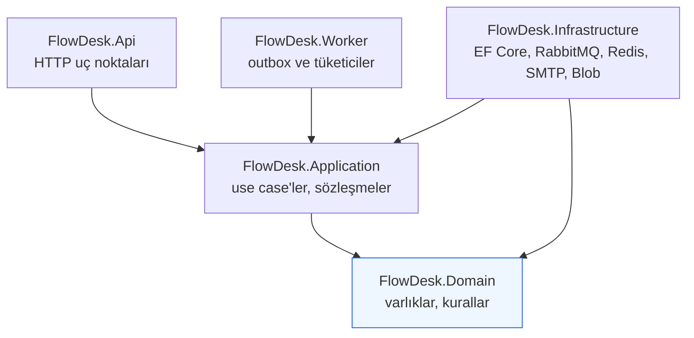
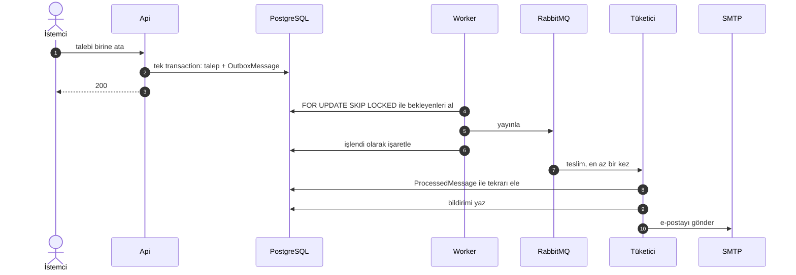
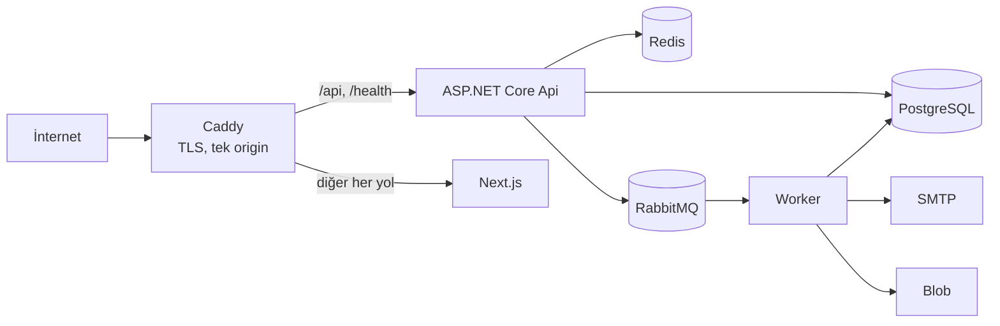

# FlowDesk — Mimari

## Mimari stil: modüler monolit

FlowDesk tek bir dağıtım birimi olarak çalışan, içeride net modül sınırları olan
bir sistemdir. Mikroservis kullanılmaz.

Gerekçe: ürün tek ekip tarafından geliştirilir, veri tutarlılığı ihtiyacı
yüksektir ve modüller arası çağrılar süreç içi kalabilir. Mikroservis bu ölçekte
dağıtık transaction, ağ hatası ve operasyon yükü getirir; karşılığında bir fayda
üretmez. Modül sınırları proje ve klasör düzeyinde korunur, böylece ileride
gerçekten gerekirse ayrıştırma mümkün olur.

## Katmanlar ve bağımlılık yönü



Oklar bağımlılık yönünü gösterir.

- **Domain** hiçbir projeye bağımlı değildir. EF Core, ASP.NET Core, Redis,
  RabbitMQ veya Azure SDK'sını tanımaz.
- **Application** yalnızca Domain'e bağımlıdır. Altyapı ihtiyaçlarını kendi
  tanımladığı arayüzlerle ifade eder (`IEmailSender`, `IFileStorage`,
  `IMessagePublisher`, `IClock` gibi).
- **Infrastructure** bu arayüzleri uygular ve somut teknolojileri barındırır.
- **Api** ve **Worker** kompozisyon köküdür; bağımlılıkları DI konteynerinde
  birleştirir.

Bu kural `FlowDesk.UnitTests` içindeki mimari testlerle otomatik doğrulanır. Test
başarısız olursa faz tamamlanmış sayılmaz.

### Bağımlılık Tersine Çevirme örneği

`Application` katmanı davet e-postası göndermek istediğinde `IEmailSender`
arayüzünü çağırır. Bu arayüz `Application` içinde tanımlıdır. SMTP/MailKit
uygulaması `Infrastructure` içindedir. Yüksek seviyeli iş mantığı, düşük
seviyeli ayrıntıya değil; her ikisi de soyutlamaya bağımlıdır.

## Proje düzeni

```
global.json                      # .NET SDK sürümü + dotnet test çalıştırıcısı
backend/
  Directory.Build.props          # tüm projeler için ortak derleme ayarları
  Directory.Packages.props       # merkezî paket sürüm yönetimi
  FlowDesk.slnx
  src/
    FlowDesk.Domain/             # varlıklar, değer nesneleri, domain kuralları
    FlowDesk.Application/        # use case'ler, sözleşmeler, izinler
    FlowDesk.Infrastructure/     # EF Core, PostgreSQL, Redis, RabbitMQ, Blob, SMTP
    FlowDesk.Api/                # HTTP uç noktaları, auth, ProblemDetails
    FlowDesk.Worker/             # outbox yayıncısı, mesaj tüketicileri
  tests/
    FlowDesk.UnitTests/          # domain kuralları, izin matrisi, mimari testler
    FlowDesk.IntegrationTests/   # WebApplicationFactory + Testcontainers
frontend/                        # Next.js App Router uygulaması
e2e/                             # Playwright senaryoları
infra/                           # docker compose, prometheus, grafana, caddy
docs/                            # proje dokümantasyonu
.github/workflows/               # CI/CD
```

### Application katmanı düzeni

Teknik katman yerine **özellik odaklı** klasörleme kullanılır:

```
Application/
  Customers/
    CreateCustomer/
    UpdateCustomer/
    ArchiveCustomer/
    GetCustomer/
    ListCustomers/
  Tickets/
    CreateTicket/
    AssignTicket/
    ChangeTicketStatus/
    ...
```

Bir özelliği değiştirmek için tek bir klasöre bakmak yeterlidir. Her use case
sınıfı tek bir işten sorumludur ve doğrudan DI ile enjekte edilir.

## Bilinçli olarak kullanılmayanlar

| Kullanılmayan | Gerekçe |
|---|---|
| MediatR | Use case sınıfları doğrudan enjekte edilebilir. Aracı katman yalnızca dolaylılık ekler. |
| Generic `IRepository<T>` | `DbSet<T>` zaten bu işi yapar. Sarmalayıcı EF Core'un projeksiyon, `Include` ve sorgu yeteneklerini köreltir. |
| Generic `UnitOfWork` | `DbContext` zaten Unit of Work'tür. Üzerine ikinci bir soyutlama gereksizdir. |
| Event sourcing | Ürün mevcut durum odaklıdır. Denetim ihtiyacı `ActivityEvent` ile karşılanır. |
| Mikroservis / Kubernetes | Bu ölçekte fayda üretmeden operasyon yükü getirir. |

## Çok kiracılılık

**Paylaşılan veritabanı + paylaşılan şema** modeli kullanılır.

```
User ──< Membership >── Tenant
```

- Bir `User` birden fazla `Membership` sahibi olabilir.
- Bir `Tenant` birden fazla `Membership` içerir.
- Rol `Membership` üzerinde tutulur, `User` üzerinde değil.
- `User` üzerinde kalıcı tek bir `TenantId` **bulunmaz**.
- Kiracıya ait tüm iş varlıkları `TenantId` taşır.

Ayrıntı ve izolasyon savunma katmanları: `docs/SECURITY.md`.

### Kiracı rotalama

Yol tabanlı: `/app/{workspaceSlug}/dashboard`. API tarafında
`/api/workspaces/{workspaceSlug}/...`. Wildcard subdomain kullanılmaz.

İstemciden gelen workspace kimliği **hiçbir zaman** doğrulanmadan kabul edilmez;
her istekte kullanıcının o tenant'taki üyeliği doğrulanır.

## Frontend mimarisi

Next.js App Router, özellik odaklı klasörleme:

```
frontend/src/
  app/             # rotalar ve düzenler
  components/
    ui/            # genel tasarım sistemi bileşenleri
    product/       # ürüne özgü bileşenler (AppSidebar, DataTable, StatusBadge...)
  features/        # özellik davranışı (customers, tickets, tasks, team...)
  hooks/
  lib/             # yardımcılar, biçimlendirme, sabitler
  services/        # HTTP istemcisi ve API erişimi
  types/           # paylaşılan tipler
```

### Veri çekme sınırı

Access token yalnızca tarayıcı belleğinde tutulduğu için Server Component'lar
ona erişemez. Bunun doğrudan sonucu:

- Kimlik doğrulaması gerektiren tüm veri çekme **istemci tarafında** yapılır:
  Client Component + TanStack Query + `Authorization: Bearer` başlığı ekleyen
  tek bir HTTP istemcisi.
- Server Component'lar yalnızca kimlik gerektirmeyen kabuk işini üstlenir:
  düzen, statik içerik, metadata, rota yapısı, iskelet durumları.
- Sunucu bileşeninden korumalı API'ye çağrı yapılmaz.

Gerekçe ve ödünleşimler: `docs/DECISIONS.md` (ADR-0009).

## Altyapı

### Kademeli devreye alma

Bir bileşen, onu gerçekten kullanan faz gelmeden `docker-compose.yml`'a
eklenmez. Amaç yerel geliştirme ortamını gereksiz ağırlaştırmamak ve her
bileşenin somut bir varlık sebebi olmasını sağlamaktır.

| Servis | Devreye girdiği faz | Çözdüğü problem |
|---|---|---|
| PostgreSQL | Faz 01 | Birincil veri deposu |
| RabbitMQ | Faz 10 | Asenkron iş akışı ve mesaj teslimi |
| Mailpit | Faz 12 | Yerelde e-posta gönderimini görünür kılma |
| Azurite | Faz 13 | Yerelde Azure Blob uyumlu nesne depolama |
| Redis | Faz 15 | Dashboard toplamlarının önbelleklenmesi |
| Prometheus + Grafana | Faz 18 | Metrik toplama ve görselleştirme |

Gözlemlenebilirlik yığını Compose profile (`--profile observability`) arkasındadır;
günlük geliştirmede isteğe bağlıdır.

### Port haritası

Bu makinede `5432`, `6379` ve `5000` başka süreçlerce kullanıldığı için
varsayılanlar bilinçli olarak kaydırılmıştır. Tüm portlar `.env` ile
yapılandırılabilir.

| Servis | Host portu | Konteyner portu | Faz |
|---|---|---|---|
| Next.js (dev) | 3000 | — | 01 |
| FlowDesk.Api | 5080 / 5443 | — | 01 |
| E2E: Next.js üretim derlemesi / FlowDesk.Api | 3100 / 5180 | — | 17 |
| PostgreSQL | 5433 | 5432 | 01 |
| RabbitMQ | 5672 | 5672 | 10 |
| RabbitMQ yönetim | 15672 | 15672 | 10 |
| Mailpit SMTP | 1025 | 1025 | 12 |
| Mailpit arayüz | 8025 | 8025 | 12 |
| Azurite blob/queue/table | 10000-10002 | 10000-10002 | 13 |
| Redis | 6380 | 6379 | 15 |
| Prometheus | 9090 | 9090 | 18 |
| Grafana | 3001 | 3000 | 18 |

## Tarayıcı testleri (E2E)

`e2e/` bağımsız bir Playwright paketidir. Suite gerçek uygulamayı kendisi
başlatır: API (5180), Worker ve frontend'in üretim derlemesi (3100). Portlar
geliştiricinin açık sunucularından ayrıdır, çünkü daha önce başlatılmış bir
API'nin rate limit sayaçları ve eski bir frontend derlemesi testin
sonucunu değiştirir. Altyapı (PostgreSQL, RabbitMQ, Mailpit, Azurite, Redis)
Compose'dan gelir ve ortam değişkenleri kökteki `.env`'den okunur. Hiçbir şey
taklit edilmez; test verisi API üzerinden hazırlanır, tarayıcı yalnızca
incelenen yolculuğa harcanır (ADR-0041).

## Gözlemlenebilirlik

Her iki host da aynı log kurulumunu kullanır: geliştirmede okunabilir satır,
diğer ortamlarda satır başına bir JSON nesnesi. Her kayıt servis adını ve varsa
izleme kimliğini taşır; API ayrıca istek başına tek bir satır yazar.

Bir isteğin arka plandaki sonuçları izlenebilir: isteğin izleme bağlamı outbox
satırında saklanır, işleyici onu sürdürerek yayınlar, broker mesajı
`traceparent` başlığıyla taşır, tüketici oradan devam eder. Dakikalar sonra
gönderilen bir e-posta, kendisini tetikleyen istekle aynı izleme kimliğini
taşır.

Metrikler çekilmez, OTLP ile Prometheus'a gönderilir: Worker'ın HTTP portu yok
ve OpenTelemetry'nin Prometheus exporter'ı hâlâ beta (ADR-0042). Çerçeveden
gelen istek ve çalışma zamanı metriklerinin üstüne FlowDesk'in kendi arka plan
görünürlüğü ölçülür — outbox'ta bekleyen, yayınlanan ve başarısız olan
mesajlar, tüketici sonuçları, önbellek okumaları. Grafana panosu ve veri
kaynağı depoda sağlanır (`infra/grafana`).

Metrik adresi boş bırakıldığında uygulama ölçmeye devam eder, hiçbir şey
göndermez — yığın kapalıyken çalışmayı değiştirmeyen bir yapılandırmadır.

## Asenkron işleme

`Api` bir iş değişikliğini kaydederken, eğer bir entegrasyon olayı gerekiyorsa,
`OutboxMessage` kaydını **aynı veritabanı transaction'ı içinde** yazar. Böylece
"veri kaydedildi ama mesaj gönderilemedi" ya da tersi durum oluşmaz.

`Worker`, bekleyen outbox kayıtlarını `FOR UPDATE SKIP LOCKED` ile alır ve
RabbitMQ'ya yayınlar. Tüketiciler en az bir kez (at-least-once) teslimat
varsayar; tekrar eden teslimatta yan etki üretmemek için `ProcessedMessage`
tablosu üzerinden idempotency uygulanır.



Worker'ın bütün bileşimi tek bir çağrıdır: `AddFlowDeskWorker`. Worker'ın
`Program`'ı ve testler aynı çağrıyı kullanır. İki hostun da kaydettiği
servisler `ITenantContext`'i isteğe bağlı çözer, çünkü Worker bu bağlamı hiç
kaydetmez (ADR-0039). Zincirin tamamı — API isteği, outbox, işleyici, broker,
tüketici, bildirim ve gerçek SMTP — `BackgroundChainTests` ile tek testte
doğrulanır.

## Dağıtım hedefi

Kubernetes kullanılmaz.



Caddy, frontend ve API'yi **aynı origin** altında sunar (`/api` alt yolu).
Bunun iki sonucu vardır: üretimde CORS'a ihtiyaç kalmaz ve refresh token çerezi
doğal olarak same-origin olur.

Gizli bilgi imaja gömülmez; ortam değişkeni ve GitHub Secrets ile sağlanır.

Üretim imajları: backend için tek Dockerfile ve iki hedef (`api`, `worker`),
frontend için Next'in `standalone` çıktısı. Üçü de kök olmayan kullanıcıyla
çalışır. Üretim benzeri yığın yerelde ayağa kalkar:

```bash
docker compose --env-file .env \
  -f infra/docker-compose.yml -f infra/docker-compose.prod.yml up -d --build
# http://localhost:8080
```

Caddy'nin arkasında istemci adresi `X-Forwarded-For`'dan okunur; bu yüzden
`Network__TrustedProxies` doldurulmalıdır (ADR-0043).

## Sürekli entegrasyon

`.github/workflows/ci.yml` faz sonu komutlarının tamamını koşar — backend
derleme ve testler, frontend biçim/lint/tip/derleme, tarayıcı testleri,
bağımlılık taraması — ve üç üretim imajını derler. İmajlar yayınlanmaz: kayıt
defteri kararı verilmedi (ADR-0044).

Ortamlar birbirine karışmaz: tarayıcı testleri kendi veritabanını
(`flowdesk_e2e`), kendi exchange'ini ve kendi kuyruk önekini kullanır.
